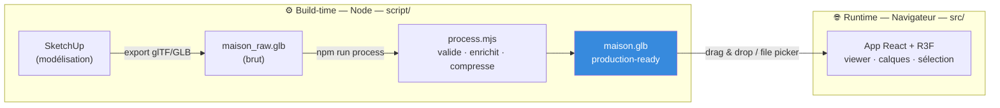
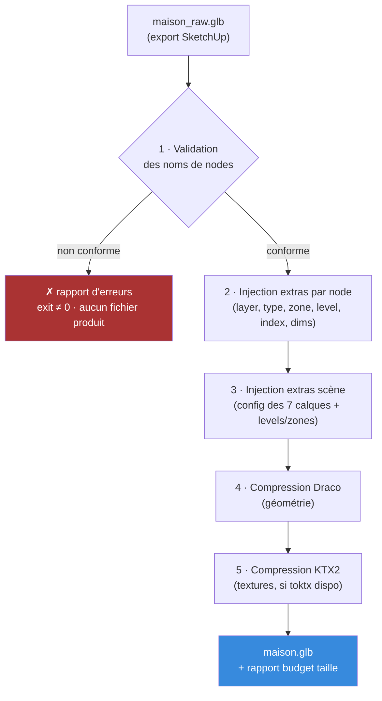
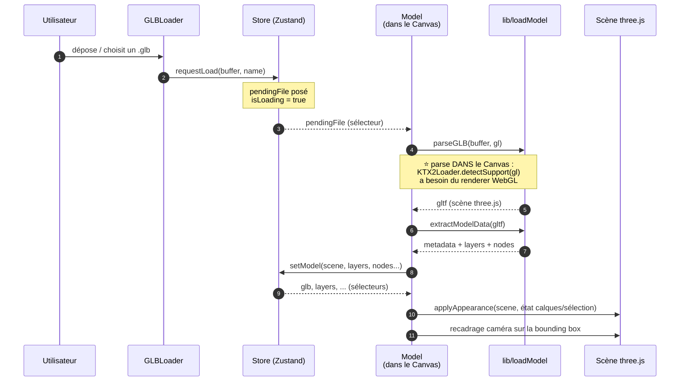

# Architecture — Home3D Viewer

> Document d'entrée pour comprendre le projet et y contribuer.
> Public visé : un développeur qui découvre le dépôt et veut savoir
> _comment c'est branché_ et _où toucher_ pour ajouter une fonctionnalité.
>
> Documents liés :
> [cahier des charges](../HTD_cahier_des_charges.md) (le _quoi_ et le _pourquoi_),
> [backlog](../BACKLOG.md) (les user stories, IDs `E*-*` cités dans le code),
> [workflow SketchUp](./workflow-sketchup.md) (produire un GLB exploitable).

---

## 1. Vue d'ensemble en 30 secondes

Home3D Viewer est une **app web locale** qui affiche une maison en 3D avec des
**calques techniques** (structure, électricité, plomberie…) qu'on peut allumer,
éteindre, isoler, coloriser, et dont on inspecte chaque objet au clic.

Le projet a **deux moitiés** reliées par un seul fichier `.glb` :



- **Moitié _build_ (`home3d/script/`)** : un pipeline Node qui transforme
  l'export SketchUp brut en GLB « production-ready ». Il **valide** les noms
  d'objets, **injecte** les métadonnées, **compresse** la géométrie et les textures.
- **Moitié _runtime_ (`home3d/src/`)** : l'app React/R3F qui charge ce GLB,
  en lit les métadonnées et offre l'interface 3D.

**Le point clé à retenir** : le fichier GLB est le **contrat** entre les deux
moitiés. Tout ce dont le viewer a besoin — géométrie, sémantique de chaque objet,
configuration des calques (libellés, couleurs, visibilité) — voyage **à l'intérieur
d'un GLB auto-descriptif**, dans son champ `extras`. L'app n'a quasiment **aucune
configuration en dur** : elle lit tout depuis le fichier.

---

## 2. Stack technique & justifications

| Outil | Rôle | Pourquoi celui-là |
|---|---|---|
| **Vite** | Build / dev server | App locale statique, pas de SSR. Next.js serait une complexité inutile (Server Components incompatibles WebGL). Migration possible en V2 si besoin d'API. |
| **React 19** | UI déclarative | Socle de R3F. |
| **React Three Fiber** (R3F) | Three.js en JSX | Décrit la scène 3D comme un arbre de composants React, synchronisé avec l'état. |
| **Drei** | Helpers R3F | `OrbitControls`, `Grid` prêts à l'emploi. |
| **Zustand** | État global | Store minimal, sélecteurs granulaires, **structurable pour l'undo/redo V2** (command pattern + `zundo`) sans refonte. |
| **three.js** | Moteur WebGL | Sous-jacent à R3F ; utilisé directement dans `lib/` (loaders, matériaux, raycast). |
| **@gltf-transform** | Pipeline GLB (Node) | Lecture/écriture glTF, injection des `extras`, compression Draco. |
| **draco3dgltf / toktx** | Compression | Draco (géométrie) et KTX2 (textures, via l'outil externe `toktx`). |
| **r3f-perf** | Mesure perf (dev) | Overlay draw calls / fps, **exclu du bundle de prod**. |

### Deux décisions structurantes (cf. cahier des charges)

- **GLB plutôt que glTF multi-fichiers** : un seul fichier binaire à distribuer,
  aucun risque de désynchronisation, standard supporté par tous les loaders.
- **Métadonnées dans `extras` plutôt qu'un JSON compagnon** : pas de second
  fichier à tenir synchronisé ; le GLB se suffit à lui-même.

---

## 3. Arborescence du projet

```
HDT/                              ← racine du dépôt
├── HTD_cahier_des_charges.md     ← spécification (V1 + anticipation V2/V3)
├── BACKLOG.md                    ← epics & user stories (IDs E*-* cités en commentaires)
├── docs/
│   ├── architecture.md           ← CE DOCUMENT
│   └── workflow-sketchup.md      ← checklist de modélisation → GLB
└── home3d/                       ← l'application (tout npm/Vite vit ici)
    ├── README.md                 ← démarrage rapide
    ├── package.json              ← scripts npm, dépendances
    ├── vite.config.js
    ├── eslint.config.js          ← lint navigateur (src/) + Node (script/)
    ├── public/
    │   ├── models/               ← GLB de dev (gitignorés, sauf .gitkeep)
    │   ├── draco/  basis/        ← décodeurs copiés de `three` en postinstall (gitignorés)
    │   └── favicon.svg
    ├── script/                   ← ⚙️ PIPELINE (Node, build-time)
    │   ├── process.mjs           ← pipeline principal : valide → extras → Draco → KTX2
    │   ├── naming.mjs            ← convention de nommage (regex, parse) — cœur testable
    │   ├── naming.test.mjs       ← tests unitaires (node --test)
    │   ├── make-test-model.mjs   ← génère un GLB de test sans SketchUp
    │   └── copy-decoders.mjs     ← postinstall : copie draco/basis dans public/
    └── src/                      ← 🌐 APP (navigateur, runtime)
        ├── main.jsx              ← point d'entrée React
        ├── App.jsx               ← layout + raccourcis clavier globaux
        ├── index.css             ← styles (canvas plein écran + panneaux superposés)
        ├── store/
        │   └── useStore.js       ← ⭐ Zustand : source de vérité unique
        ├── components/
        │   ├── Viewer.jsx        ← <Canvas> R3F : caméra, lumières, controls, grille
        │   ├── Model.jsx         ← parse le GLB (dans le Canvas) + raycast clic/survol
        │   ├── GLBLoader.jsx     ← drag & drop, file picker, toolbar, erreurs
        │   ├── LayerPanel.jsx    ← panneau calques (toggle, isoler, coloriser)
        │   ├── InfoPanel.jsx     ← infos de l'objet sélectionné
        │   ├── VisitControls.jsx ← mode visite 1re personne : pointer lock + WASD (E17 N1)
        │   └── VisitOverlay.jsx  ← invite « Cliquez pour explorer » du mode visite
        └── lib/                  ← logique pure, sans React
            ├── loadModel.js      ← parse GLB + extraction des extras
            └── appearance.js     ← applique calques/sélection/survol sur la scène
```

> **Note** : `Model.jsx` et `lib/` n'apparaissent pas dans l'arborescence du
> cahier des charges — ce sont des raffinements apparus à l'implémentation
> (séparer le parse/raycast du Canvas, et sortir la logique three.js pure de React).

---

## 4. Les deux flux de données

### 4.1 — Flux de production (build-time) : SketchUp → GLB enrichi

Tout export SketchUp passe **obligatoirement** par `script/process.mjs` avant
d'être chargé dans l'app. C'est la pièce centrale.



**Le nommage est le pivot** : chaque objet SketchUp doit s'appeler
`systeme__type__zone__niveau__index` (ex. `structure__mur_porteur__salon__rdc__001`).
Le pipeline **dérive** les métadonnées de ce nom — d'où la validation stricte en
amont. Cette logique vit dans [`naming.mjs`](../home3d/script/naming.mjs), **isolée
de `process.mjs` pour être testable unitairement** ([`naming.test.mjs`](../home3d/script/naming.test.mjs), 29 cas).

Détail complet du workflow côté modeleur : [workflow-sketchup.md](./workflow-sketchup.md).

> ⚠️ Les **node names sont des identifiants immuables** : ils sont la clé de
> liaison GLB ↔ extras. On ne les renomme jamais, ni dans le pipeline ni dans
> l'app (prérequis pour l'édition V2).

### 4.2 — Flux runtime (navigateur) : du `.glb` déposé à l'écran

C'est le flux le plus important à comprendre pour contribuer à l'app. Le
séquencement n'est **pas** trivial — et pour une raison précise (voir la note).



> **⭐ Pourquoi le parse vit-il dans `Model.jsx` (donc dans le `<Canvas>`) et pas
> dans `GLBLoader.jsx` ?**
> Le `KTX2Loader` doit appeler `detectSupport(gl)` avec le **renderer WebGL**
> pour savoir quels formats de texture compressée le GPU accepte. Ce `gl` n'existe
> qu'à l'intérieur du Canvas R3F (via `useThree`). D'où le découpage :
> `GLBLoader` ne fait que **lire les octets** et les pousser dans le store
> (`pendingFile`) ; `Model`, qui vit dans le Canvas, **consomme** ce `pendingFile`
> et fait le parse. Le store sert de **boîte aux lettres** entre les deux.

Le même motif « la donnée traverse le store car l'émetteur et le consommateur
sont de part et d'autre du Canvas » se retrouve pour le **recadrage caméra** :
le bouton « Recentrer » (hors Canvas) incrémente un compteur `fitRequest` ;
`Model` (dans le Canvas, seul à avoir accès à la caméra) réagit à ce compteur.

---

## 5. Le store Zustand — source de vérité unique

[`src/store/useStore.js`](../home3d/src/store/useStore.js) centralise **tout**
l'état. Les composants s'y connectent par **sélecteurs** (jamais l'objet entier),
ce qui évite les re-renders globaux.

```
useStore = {
  // ── Modèle chargé ──────────────────────────────────────────
  glb,            // { scene: THREE.Group, fileName } | null
  metadata,       // extras de la scène racine ({ model, layers })
  nodes,          // { [nodeName]: extras }  ← liaison GLB ↔ métadonnées

  // ── Calques ────────────────────────────────────────────────
  layers,         // { structure: { visible, color, label }, ... }
  toggleLayer, setAllLayersVisible, isolateLayer,
  colorByLayer, toggleColorByLayer,

  // ── Sélection / survol (référencés par node name) ──────────
  selectedNode, selectNode,
  hoveredNode,  hoverNode,      // garde d'égalité : pas de re-render si inchangé

  // ── Caméra & perf (pont hors-Canvas → Canvas) ─────────────
  fitRequest, requestFit,        // compteur consommé par Model
  showPerf, togglePerf,          // overlay r3f-perf (dev)

  // ── Mode visite 1re personne (E17 N1) ─────────────────────
  viewMode, setViewMode, toggleViewMode,   // 'orbit' | 'visit'
  pointerLocked, setPointerLocked,         // état du verrou souris natif

  // ── Cycle de chargement ────────────────────────────────────
  pendingFile, isLoading, loadError,
  requestLoad, setModel, setLoadError, clearLoadError,

  // ── V2 (emplacements réservés, en commentaire) ─────────────
  // history, future, push, undo, redo   ← command pattern + zundo
}
```

**Deux principes non négociables** (epic E7, « architecture V2-ready ») :

1. **Toute mutation passe par une action nommée.** Aucune écriture directe dans
   l'état depuis un composant. C'est le prérequis pour brancher le _command
   pattern_ + le middleware `zundo` (undo/redo) en V2 **sans réécrire** les
   composants.
2. **Les objets sont référencés par leur node name** (string immuable), jamais
   par une référence d'objet three.js. Cohérent avec le contrat GLB ↔ extras.

---

## 6. Composants & responsabilités

| Composant | Rôle | Lit dans le store | Subtilité |
|---|---|---|---|
| [`App`](../home3d/src/App.jsx) | Layout + raccourcis clavier globaux (`R` recadrer, `P` perf en dev, `V` visite, `Échap` quitter la visite) | `requestFit`, `togglePerf`, `toggleViewMode`, `setViewMode` | Ignore les raccourcis si focus dans un input. |
| [`Viewer`](../home3d/src/components/Viewer.jsx) | Le `<Canvas>` : caméra, 3 lumières, `OrbitControls`, `Grid`, overlay perf | `selectNode`, `showPerf` | Clic dans le vide = désélection, **avec garde anti-drag** (on ne désélectionne que si le pointeur a peu bougé). |
| [`Model`](../home3d/src/components/Model.jsx) | Parse le GLB (dans le Canvas), raycast clic/survol, applique l'apparence, recadre la caméra | quasi tout | Cœur du runtime. Voir §4.2. |
| [`GLBLoader`](../home3d/src/components/GLBLoader.jsx) | Drag & drop fenêtre, file picker, toolbar, bannière d'erreur, modèle de démo | `glb`, `isLoading`, `loadError`, actions | Compteur enter/leave pour un feedback de drag fiable malgré les éléments imbriqués. |
| [`LayerPanel`](../home3d/src/components/LayerPanel.jsx) | Liste des calques, toggle, Tout/Aucun, Isoler, colorisation | `layers` + actions | Se masque tant qu'aucun modèle n'est chargé. |
| [`InfoPanel`](../home3d/src/components/InfoPanel.jsx) | Métadonnées de l'objet sélectionné, libellés FR | `selectedNode`, `nodes`, `layers` | Affiche un message dédié pour les objets « non classés ». |
| [`VisitControls`](../home3d/src/components/VisitControls.jsx) | Mode visite 1re personne « vol libre » (E17 N1) : `PointerLockControls` + déplacement WASD/flèches | `glb`, `setPointerLocked` | Vit dans le Canvas ; rendu à la place d'`OrbitControls` quand `viewMode === 'visit'`. Sans gravité ni collision (Niveau 2 à venir). |
| [`VisitOverlay`](../home3d/src/components/VisitOverlay.jsx) | Invite « Cliquez pour explorer » du mode visite | `viewMode`, `pointerLocked` | `pointer-events: none` → le clic traverse jusqu'au canvas pour verrouiller la souris. |

**L'UI est un pur _overlay_** : le `<Canvas>` occupe tout l'écran ; les panneaux
sont en `position: absolute` par-dessus (cf. [`index.css`](../home3d/src/index.css)).
Pas de layout complexe, pas de scroll de page.

---

## 7. `lib/` — la logique three.js sans React

Sortir cette logique des composants la rend lisible et (à terme) testable hors
du cycle de rendu React.

### [`loadModel.js`](../home3d/src/lib/loadModel.js) — parse & extraction

- `parseGLB(buffer, gl)` : instancie **une seule fois** un `GLTFLoader` câblé sur
  `DRACOLoader` + `KTX2Loader` (décodeurs servis **localement** depuis `public/`,
  aucune dépendance CDN au runtime).
- `extractModelData(gltf)` : lit les `extras` (que `GLTFLoader` range dans
  `userData`) → renvoie `{ metadata, layers, nodes }`.
  - **Erreur explicite** (`PipelineError`) si les extras scène manquent → le
    fichier n'est pas passé par le pipeline.
  - **Repli « non classé »** : tout mesh sans calque (propre ou hérité) est
    rattaché à un calque `non_classe`. C'est **le seul** morceau de config en dur
    de l'app ; tout le reste vient du GLB.

### [`appearance.js`](../home3d/src/lib/appearance.js) — projeter l'état sur la scène

`applyAppearance(scene, { layers, colorByLayer, selectedNode, hoveredNode })`
fait **une seule passe récursive** sur la scène qui gère, ensemble :

- la **visibilité** par calque (`object.visible`) ;
- la **colorisation** par calque (matériau teinté **partagé** par calque, mis en
  cache dans un `WeakMap` par scène) ;
- la **surbrillance** émissive de la sélection (forte) et du survol (légère).

Invariant clé : **les matériaux d'origine sont conservés** (`userData.__origMaterial`)
→ tout est **réversible sans recharger le GLB**. `isChainVisible(object)` complète
le dispositif côté raycast : three.js ne teste pas la visibilité nativement, donc
on filtre manuellement les objets des calques masqués (E6-03).

---

## 8. Invariants & concepts clés

Les règles à ne pas casser. La plupart sont déjà annotées dans le code.

| Invariant | Où | Pourquoi |
|---|---|---|
| **Node names immuables** | partout | Clé de liaison GLB ↔ extras ; prérequis édition V2. |
| **Config pilotée par le GLB** | `loadModel.js`, store | L'app n'a pas de liste de calques en dur (sauf le repli `non_classe`). Ajouter un calque = le mettre dans `LAYERS_CONFIG` côté pipeline, pas dans l'app. |
| **Matériaux d'origine préservés** | `appearance.js` | Colorisation/surbrillance réversibles sans rechargement. |
| **Raycast filtré sur la visibilité** | `appearance.js` + `Model.jsx` | three.js ne le fait pas ; sinon on sélectionnerait des objets masqués. |
| **Une seule passe d'apparence** | `appearance.js` | Visibilité + couleur + surbrillance calculées ensemble, pas en plusieurs balayages. |
| **Mutations via actions nommées** | `useStore.js` | Branchement `zundo` (undo/redo) V2 sans refonte. |
| **Garde d'égalité sur le survol** | `hoverNode` | `onPointerMove` tire en continu ; ne notifier que si le node change → pas de chute de framerate. |

---

## 9. Conçu pour la V2 (édition in-app)

La V1 ne fait que **visualiser**, mais l'architecture est posée pour la V2
(édition / undo-redo) sans réécriture :

- Les `extras` de chaque node embarquent `material` / `notes` (vides, prêts à
  être édités) et `dims` — ce dernier **calculé automatiquement** depuis la
  bounding box dès la V1 (issue #9), surchargeable manuellement en V2.
- Le store réserve, **en commentaire**, les emplacements `history` / `future` /
  `push` / `undo` / `redo` : on y branchera le _command pattern_ + le middleware
  [`zundo`](https://github.com/charkour/zundo).
- Le raycasting (clic) est déjà en place → support futur de `TransformControls`
  pour déplacer un objet.
- Backlog correspondant : epic **E10** (`BACKLOG.md`).

---

## 10. Contribuer

### Démarrer

```bash
cd home3d
npm install            # installe + copie les décodeurs Draco/Basis (postinstall)
npm run dev            # serveur Vite
npm run model:test     # (optionnel) génère un GLB de test sans SketchUp...
npm run process -- public/models/maison_raw.glb   # ...puis le passe au pipeline
```

Charger ensuite un GLB par drag & drop, le bouton « Ouvrir un GLB… », ou
« Modèle de démo ».

### Scripts npm

| Script | Rôle |
|---|---|
| `npm run dev` / `build` / `preview` | Vite |
| `npm run lint` / `format` | ESLint / Prettier |
| `npm test` | Tests du pipeline (`node --test`, sur `script/`) |
| `npm run model:test` | GLB de test (option `--invalid` pour démo du rapport d'erreurs) |
| `npm run process` | Pipeline GLB |

### Où toucher pour… (aide-mémoire)

| Je veux… | Aller dans… |
|---|---|
| Ajouter / renommer un **calque** (système) | [`script/naming.mjs`](../home3d/script/naming.mjs) → `SYSTEMS` + `LAYERS_CONFIG`, puis re-`process` le GLB. **Pas** dans l'app. |
| Ajouter un **niveau** (`r3`, `combles2`…) | `naming.mjs` → `LEVELS` (et la regex). |
| Changer une **règle de nommage** | `naming.mjs` (`NODE_NAME_REGEX`, `validateNodeName`) + couvrir dans `naming.test.mjs`. |
| Afficher un nouveau **champ d'extras** dans le panneau | [`InfoPanel.jsx`](../home3d/src/components/InfoPanel.jsx) (+ injection dans `process.mjs` si c'est une nouvelle donnée). |
| Changer **caméra / lumières / grille** | [`Viewer.jsx`](../home3d/src/components/Viewer.jsx). |
| Modifier la **surbrillance** sélection/survol | [`lib/appearance.js`](../home3d/src/lib/appearance.js). |
| Ajouter un **état / une action** | [`store/useStore.js`](../home3d/src/store/useStore.js) (action nommée ; brancher via sélecteur). |
| Toucher au **chargement / parse** | [`lib/loadModel.js`](../home3d/src/lib/loadModel.js) (extraction) + [`Model.jsx`](../home3d/src/components/Model.jsx) (orchestration dans le Canvas). |

### Conventions observées dans le code

- **Commentaires en français**, référençant les IDs du backlog (`E5-04`, `E6-01`…)
  pour relier le code à sa user story.
- **Sélecteurs Zustand** systématiques (`useStore((s) => s.xxx)`), jamais le store entier.
- **Actions nommées** pour toute mutation (cf. §5 / §8).
- ESLint + Prettier ; le lint distingue le contexte navigateur (`src/`) du contexte
  Node (`script/`) — cf. `eslint.config.js`.

### Carte de la documentation

| Document | Pour quoi |
|---|---|
| [`HTD_cahier_des_charges.md`](../HTD_cahier_des_charges.md) | Le _quoi_ et le _pourquoi_ : scope V1, anticipation V2/V3, décisions. |
| [`BACKLOG.md`](../BACKLOG.md) | Epics & user stories ; les IDs `E*-*` cités en commentaires de code. |
| [`docs/workflow-sketchup.md`](./workflow-sketchup.md) | Côté modeleur : produire un GLB exploitable du premier coup. |
| **`docs/architecture.md`** (ici) | Côté développeur : comment c'est branché, où contribuer. |
| [`home3d/README.md`](../home3d/README.md) | Démarrage rapide. |

---

## 11. Glossaire

| Terme | Définition |
|---|---|
| **GLB** | Format binaire mono-fichier de glTF 2.0 (standard Khronos). Le format de distribution du modèle. |
| **`extras`** | Champ libre de la spec glTF où le pipeline injecte nos métadonnées (par node + sur la scène). `GLTFLoader` les expose dans `userData`. |
| **node** | Objet de la scène glTF (un mur, une prise…). Son **nom** suit la convention et sert de clé. |
| **calque / Tag** | Système technique (`structure`, `elec`…). Côté SketchUp on parle de « Tag », côté app de « calque ». |
| **pipeline** | `script/process.mjs` : la chaîne de post-traitement de l'export SketchUp. |
| **Draco / KTX2** | Compression de la géométrie (Draco) et des textures (KTX2, via `toktx`). |
| **draw call** | Une instruction de dessin GPU. Three.js en émet ~1 par mesh ; au-delà de ~200-300 sur hardware moyen, optimiser (instancing, merge — epic E8). |
| **R3F** | React Three Fiber : Three.js piloté en JSX. |
| **raycasting** | Lancer un rayon depuis le curseur pour savoir quel objet 3D est sous la souris (sélection, survol). |

---

*Dernière mise à jour : 2026-06-21 (ajout du mode visite 1re personne, E17 Niveau 1).
À tenir à jour avec l'évolution du code — en particulier l'arborescence (§3),
le flux runtime (§4.2) et le store (§5).*
