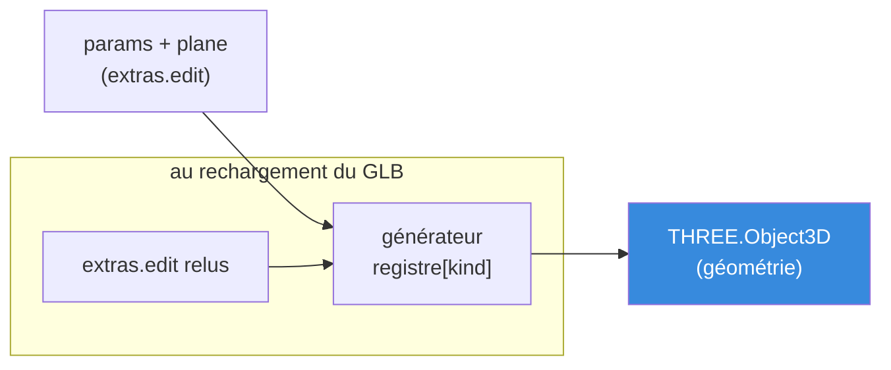
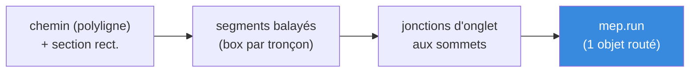

# Conception — Edit mode (édition in-app, V2)

> Document de conception du **mode édition** : créer des objets directement dans
> l'app, sans repasser par SketchUp. C'est le plus gros chantier post-V1.
>
> Public visé : développeur qui va implémenter Edit mode, et décideur produit qui
> veut comprendre le périmètre et les arbitrages.
>
> Documents liés :
> [cahier des charges](../HTD_cahier_des_charges.md) (le _quoi_/_pourquoi_, scope),
> [backlog](../BACKLOG.md) (user stories, epics E12→E16),
> [architecture](./architecture.md) (comment l'app V1 est branchée).

---

## 1. Objectif & cadrage

La V1 ne fait que **visualiser** un modèle produit dans SketchUp. La V2 introduit
la **création/édition d'objets dans l'app**.

**Cadrage validé** (cf. décisions § 2) :

> SketchUp reste l'auteur de la **coquille** (murs, structure, terrain, dalles).
> Edit mode pose **par-dessus** les **systèmes techniques** (électricité, plomberie)
> et les **ouvertures** (fenêtres), en **objets paramétriques** de première classe
> qui respectent le contrat existant : calques / `extras` / node names immuables.

On vise donc d'abord une couche **« BIM-lite MEP + ouvertures »** sur une coquille
importée — pas un modeleur 3D généraliste. L'architecture reste néanmoins **ouverte**
vers le modeleur complet (V3), car les primitives d'esquisse (rectangle/cercle/arc)
en sont déjà le socle.

**Pourquoi cette couche-là ?** C'est exactement ce qui est pénible et casse-gueule
à modéliser dans SketchUp (router des dizaines de mètres de câble/tuyau, placer et
nommer des dizaines de prises) mais **naturel à poser paramétriquement**. Et ce
sont précisément les calques qui existent déjà (`elec`, `plomberie`, `ouvertures`).

---

## 2. Décisions validées

| # | Décision | Choix retenu | Conséquence |
|---|---|---|---|
| D1 | Portée d'Edit mode | **Technique d'abord, généraliste plus tard.** La coquille reste SketchUp. | Périmètre maîtrisé ; archi ouverte vers V3. |
| D2 | Paradigme d'édition | **3D direct + plans de travail + snapping/inférence** (façon SketchUp/Fusion). Pas de vue plan 2D. | Effort concentré sur un moteur (plans + snapping). |
| D3 | Représentation | **Paramétrique.** Objet = node + `extras.edit { kind, plane, params, variant }` ; géométrie régénérée au chargement. | Ré-éditable après rechargement ; node names auto-générés. |
| D4 | 1re tranche (MVP) | **Formes + fenêtres** d'abord (Slice 0 puis 1), élec (Slice 2), plomberie (Slice 3). | Front-load le moteur d'esquisse réutilisable. |
| D5 | Fenêtres ↔ murs | **Vrais trous** : booléen CSG réel sur le mur importé (`three-bvh-csg`). | Visuellement correct ; prévoir garde-fous non-manifold. |
| D6 | Câbles & tuyaux | **Profil rectangulaire balayé** (pas de cylindres) pour réduire les polygones. | Coudes/raccords = jonctions d'onglet ; Ø catalogue → sections rectangulaires. |
| D7 | Undo/redo & persistance | **Go** : undo/redo (`zundo`) + ré-export GLB, transverses à Edit mode (E10-03/04). | Voir § 5.5 et § 5.6. |
| — | Perf 3D (E8-02→05) | **En pause**, à reprendre selon la complexité réelle. | Hors scope V2 immédiat. |

---

## 3. Revue du marché (ce qu'on emprunte)

| Famille | Référence | L'idée volée |
|---|---|---|
| **BIM MEP** | Revit, AutoCAD MEP | **Familles paramétriques** (type → paramètres) ; **routage** : tracer une polyligne → segments **et raccords auto** aux sommets ; notion de **circuit/système**. |
| **Home-design web** | Sweet Home 3D, Floorplanner, Planner5D | **Catalogue** d'objets ; la **fenêtre déposée sur un mur le perce** (booléen) ; variantes de gabarit. |
| **CAD sketch** | Fusion 360, SketchUp | **Esquisse sur un plan de travail** ; **inférence/snapping** (extrémités, milieux, axes) ; **saisie numérique exacte** (longueur, Ø). |

**Les 7 invariants UX qu'on adopte** (les facteurs « ça fait du bien » vs « c'est frustrant ») :

1. **Mode View / Edit séparé**, palette d'outils + inspector (panneau propriétés).
2. **Snapping / inférence** — le facteur n°1 de confort en 3D.
3. **Plan de travail / contrainte de niveau** — éditer sur un plan tue l'ambiguïté de profondeur.
4. **Palette de types + propriétés d'instance** — choisir « cuivre Ø16 », poser, ajuster par instance.
5. **Manipulation directe** par gizmos (`TransformControls`) + poignées de redimensionnement paramétrique.
6. **Saisie numérique exacte** (façon VCB SketchUp).
7. **Non-destructif** : undo/redo partout + paramétrique = ré-éditable.

---

## 4. Taxonomie des objets (le levier de précision)

Tout ce qu'on veut créer se ramène à **3 catégories d'interaction**. C'est ce qui
rend le dev simple : 3 moteurs d'interaction, pas 15 outils ad hoc.

| Cat. | Interaction | Objets | Paramètres clés | Géométrie |
|---|---|---|---|---|
| **① Ponctuel** | cliquer-poser (souvent sur une face de mur) | prise, interrupteur, boîte de dérivation, compteur, valve | type/variante, hauteur/sol, orientation | composant catalogue (mesh paramétrique léger) |
| **② Linéaire (routé)** | tracer un chemin → géométrie + raccords auto | câble élec, tuyau cuivre/PVC/évacuation | section **rectangulaire** (catalogue), matériau, (pente pour l'évac) | **profil rectangulaire balayé** le long du chemin (cf. § 5.3) |
| **③ Ouverture / forme** | dessiner sur un plan / déposer sur un mur | rectangle, cercle, arc, fenêtre | dims, rayon, angle / largeur·hauteur·allège·variante | esquisse paramétrique ; fenêtre = **booléen** sur le mur (§ 5.4) |

> ① et ② sont presque entièrement **partagés** entre élec et plomberie → Slice 2
> (élec) construit le routage, Slice 3 (plomberie) le réutilise.

---

## 5. Architecture

### 5.1 — Le modèle paramétrique (cœur d'Edit mode)

Un objet créé in-app reste **un node glTF normal**, simplement enrichi d'un bloc
`edit` dans ses `extras`. C'est ce qui le garde **ré-éditable après rechargement**
et **compatible avec le re-export** sans rien casser au contrat V1.

```jsonc
// extras d'un node créé in-app (ex. une fenêtre)
{
  // ── champs V1 inchangés (cf. cahier des charges) ──
  "layer": "ouvertures", "type": "fenetre", "zone": "salon",
  "level": "rdc", "index": 7,
  "dims": { "largeur_m": 1.2, "profondeur_m": 0.2, "hauteur_m": 1.0 }, // dérivé des params
  "material": "", "notes": "",

  // ── extension Edit mode ──
  "source": "app",                 // distingue créé in-app vs importé SketchUp
  "edit": {
    "kind": "opening.window",      // clé de registre → fonction génératrice
    "plane": { "faceOf": "structure__mur_porteur__salon__rdc__001" },
    "params": { "largeur_m": 1.2, "hauteur_m": 1.0, "allege_m": 0.9 },
    "variant": "classique"
  }
}
```

**Registre `kind → générateur`.** Au chargement, un registre central associe chaque
`kind` à une fonction pure `generate(params, plane, ctx) → THREE.Object3D`. C'est
**la couture d'extensibilité** : ajouter un nouvel objet = ajouter une entrée au
registre. Exemples de `kind` : `sketch.rect`, `sketch.circle`, `sketch.arc`,
`opening.window`, `elec.outlet`, `elec.switch`, `elec.junction`, `elec.meter`,
`mep.run` (câble/tuyau routé), `mep.valve`.



> **Invariant** : la géométrie est **dérivée** des params, jamais l'inverse. On édite
> les params (inspector, poignées) → on régénère. Les `dims` V1 sont recalculés
> depuis les params (cohérent avec E2-10).

### 5.2 — Les 3 piliers du « 3D direct + snapping » (D2)

Le choix du paradigme concentre l'effort sur un **moteur d'édition** (epic E12).

**Pilier 1 — Plan d'esquisse.** Toute création se fait sur un plan actif.

> **Amendement 2026-06-24 (« façon SketchUp »).** On abandonne le **choix manuel**
> d'un plan (menu global XY/XZ/YZ / niveau, essayé puis retiré) au profit d'un plan
> **contextuel**, comme SketchUp : on dessine sur le **sol (niveau 0)** par défaut, et
> dès que le curseur **survole une face** d'un mesh, le plan d'esquisse **devient cette
> face** (aucun menu). Les « points de référence » (arêtes, intersections, niveaux) ne
> sont pas un sélecteur mais des **cibles d'inférence** (Pilier 2 / E12-03). Le passage
> 2D → volume se fait avec **Push/Pull** (E12-08), pas en pré-choisissant une épaisseur.

Sources de plan, par ordre de priorité contextuelle :
- **face d'un mesh survolé** (« esquisser sur la face ») — clé pour poser une fenêtre/prise sur un mur ;
- **sol / niveau 0** par défaut (et plans de niveau dérivés des `levels` comme simples cotes d'inférence, pas comme menu).

**Pilier 2 — Snapping / inférence** (le plus gros morceau, le n°1 du confort).
- Cibles : grille du plan, **extrémités/milieux** des primitives et objets app, **sommets/arêtes du mur importé**, axes X/Y/Z, parallèle/perpendiculaire.
- Le raycast three.js natif est trop lent sur gros mesh → **`three-mesh-bvh`** pour accélérer raycast et requêtes de proximité (réutilisé par le CSG **et** la perf E8 plus tard).
- Retour visuel : marqueurs de snap + lignes d'inférence colorées.

**Pilier 3 — Primitives d'esquisse paramétriques** + **saisie numérique exacte**
(taper une longueur/rayon pendant le tracé, façon VCB SketchUp).

### 5.3 — Profil rectangulaire pour les objets linéaires (D6)

Câbles et tuyaux sont **balayés avec une section rectangulaire**, pas un cercle :

- **Pourquoi** : un segment rectangulaire = **4 faces** ; un tube cylindrique en
  demande 8 à 32. Sur un réseau de plomberie/élec complet, le gain de polygones est
  massif (cohérent avec la préoccupation perf initiale, epic E8).
- **Section** : `{ largeur_m, hauteur_m }`. Les diamètres « catalogue » (cuivre Ø12/14/16/18/22, PVC, évacuation Ø32/40/100) deviennent des **presets de section rectangulaire** d'emprise équivalente. On conserve l'**identité nominale** (`diametre_mm`) dans les params pour l'étiquetage, mais on **rend** un profil rectangulaire.
- **Orientation** : la section est orientée par le plan de travail / un vecteur « haut ».
- **Coudes / raccords / tés** : générés **automatiquement** aux sommets du chemin par **jonction d'onglet** (mitre) entre sections rectangulaires — bien plus simple que des coudes toriques.
- **Valves** (objet ① inline) : insérées sur un segment, coupent le run en deux.



### 5.4 — Ouvertures : booléen sur le mur importé (D5)

> **Une fenêtre = deux choses distinctes, livrées en deux temps :**
> **(1)** l'**ouverture** = un **vrai vide** creusé dans le mur (le morceau risqué) ;
> **(2)** la **menuiserie** = le **cadre + vitrage** posé dans ce vide (cosmétique, facile).

**Phase 1 — l'ouverture (le vide).** Le mur SketchUp importé est percé via **CSG réel**
(`three-bvh-csg`, qui s'appuie sur `three-mesh-bvh`).

- **Principe** : `mur_résultat = mur_importé − volume_de_découpe` (un box paramétrique — largeur/hauteur/allège — posé sur la face du mur).
- **Non-destructif** : on **ne modifie jamais** le mesh importé d'origine. La découpe est **recalculée au chargement** à partir des `extras.edit` des ouvertures qui référencent ce mur (`plane.faceOf`). Le mur d'origine reste la source ; le mur percé est dérivé.
- **Garde-fous** (risque principal — les exports SketchUp sont souvent **non-manifold**) :
  - détecter un résultat CSG dégénéré (volume nul, explosion de triangles) → **fallback** : ne pas percer, signaler à l'utilisateur, poser l'objet en surface ;
  - valider l'approche **tôt** sur un **vrai export SketchUp** (pas seulement le modèle de test) — c'est le jalon de dérisquage de Slice 1.
- **Liaison** : l'ouverture référence le mur par son **node name** (immuable). Mur absent au rechargement → pas de découpe (dégradation propre).

**Phase 2 — la menuiserie (cadre + vitrage).** Un **composant posé** (catégorie ①)
hébergé dans l'ouverture, **pas un booléen**. Il réutilise donc toute la machinerie de
pose de composants construite pour l'électricité (Slice 2) → il arrive **après**, et
coûte peu. Variantes catalogue (classique / large / étroite). Les **portes** suivent
le même schéma (ouverture + vantail).

> **Conséquence de taxonomie** : une « fenêtre » se répartit sur **deux** catégories du
> § 4 — l'**ouverture** est un objet ③ (booléen), le **cadre** est un objet ① (composant
> posé). C'est ce qui permet de livrer le vide bien avant la menuiserie.

### 5.5 — Store, command pattern & undo/redo (D7, E10-03)

On respecte les 2 invariants V1 (« toute mutation via action nommée », « référence par node name ») et on branche enfin l'historique.

Nouvelle tranche de store (sélecteurs granulaires comme en V1) :

```
useStore += {
  // ── mode & outils ──
  editMode,            activeTool,        // null = View ; sinon outil courant
  workPlane,           setWorkPlane,
  draft,               // géométrie en cours de tracé (non committée)

  // ── objets app (actions nommées → emballées par zundo) ──
  createObject,        // (kind, params, plane) → node name auto-généré (E12-06)
  updateObjectParams,  // (nodeName, patch)
  deleteObject,        // (nodeName)
  moveObject,          // (nodeName, transform)

  // ── historique (enfin actif) ──
  // via middleware zundo : undo(), redo(), historique des actions ci-dessus
}
```

- **`zundo`** enveloppe le store ; on **partialize** pour n'historiser que l'état métier (objets/params/sélection), pas l'éphémère (`draft`, `hoveredNode`, `workPlane`).
- Chaque création/édition/suppression = **une entrée d'historique** atomique.

### 5.6 — Persistance / ré-export GLB (E10-04)

- **Génération des node names** (E12-06) : l'app fabrique des noms **conformes à la convention** (`système__type__zone__niveau__index`), index **auto-incrémenté** par (système, zone, niveau). ← rend le plugin SketchUp **E9-01 inutile** pour les objets créés in-app.
  - *Point ouvert* : l'attribution de la **zone** en 3D pur (pas de notion de pièce côté app) — pour l'instant choix manuel dans l'inspector, avec une « zone courante » par défaut. Voir § 7.
  - **Sous-type éditable** (E20-03) : le `type` initial vient du registre (`kindNaming`), puis reste modifiable dans l'inspector — dropdown du vocabulaire canonique du système (`SUBTYPES`, source unique `script/naming.mjs`) + « Autre… » (saisie libre normalisée, vocabulaire **ouvert**). L'index ne change pas (le bucket d'indexation reste système/zone/niveau). Les extras exportés portent `subtype` + `subtypeLabel`, comme le pipeline (E20-02).
- **Re-export** : `GLTFExporter` (navigateur) réécrit la scène en GLB. On **bake** la géométrie générée **mais on conserve les `edit.params`** dans les `extras` → le fichier reste **ré-éditable** à la prochaine ouverture. Le mur d'origine est conservé (la découpe est recalculée, pas figée).
- Re-passer le GLB par `script/process.mjs` reste possible (validation, Draco/KTX2) — les objets app passent la regex de nommage par construction.

### 5.7 — Librairies ajoutées

| Lib | Rôle | Réutilisée pour |
|---|---|---|
| **`three-mesh-bvh`** | accélère raycast & requêtes de proximité | snapping (E12-03), CSG (E14), **collision du mode visite (E17)**, perf E8 |
| **`three-bvh-csg`** | booléen CSG mesh | trou fenêtre (E14) |
| **`zundo`** | undo/redo Zustand | toutes les mutations Edit mode (E10-03) |
| `GLTFExporter` (three) | ré-export GLB | persistance (E10-04) |

---

## 6. Séquençage en tranches verticales

Chaque slice est **démontrable de bout en bout** : créer → éditer → undo/redo →
sauver → recharger → ré-éditer.

| Slice | Epic(s) | Contenu | Risque | Jalon de dérisquage |
|---|---|---|---|---|
| **0 — Socle + formes** | E12, E13, E10-03/04 | Mode édition, plans de travail, snapping, **rectangle/cercle/arc** paramétriques, inspector, undo/redo, ré-export. **Aucun booléen.** | Snapping/inférence | Tracer + ré-éditer une forme après rechargement. |
| **1 — Ouvertures** | E14 (phase 1) | **Ouverture paramétrique** (largeur/hauteur/allège) sur une face de mur → **vrai vide (CSG)**. Pas encore de cadre. | **CSG sur mur SketchUp non-manifold** | Percer un **vrai** export SketchUp sans artefact. |
| **2 — Électricité** | E15 | Prise, interrupteur, boîte, compteur (①) + **câble routé à section rectangulaire** (②). | Routage 3D + snapping aux objets | Router un câble entre 2 boîtes, coudes auto. |
| **3 — Plomberie** | E16 | Tuyaux cuivre/PVC/évac (réemploi du routage), pente évac, coudes/raccords/tés auto, valves. | Faible (réemploi de Slice 2) | Réseau d'évacuation avec pente + valve. |

> **Slice 0 d'abord** parce que les primitives d'esquisse sont le **socle réutilisable**
> de tout le reste (et du futur modeleur V3), et qu'il **ne porte aucun booléen** —
> on quarantaine le risque CSG dans Slice 1, isolé.
>
> **La menuiserie (cadres de fenêtre) arrive après la Slice 2** : c'est un composant
> posé (catégorie ①), pas un booléen — elle réutilise la pose de composants de l'élec.
> La Slice 1 ne livre donc que le **vide** dans le mur.

### 6.1 — Articulation avec le mode visite (E17) et le spike

Le **mode visite** (vue 1re personne, type « Visite » SketchUp) est une feature
**Viewer**, orthogonale à l'édition, mais son séquençage s'entrelace avec les slices :

- **Visite Niveau 1** (vol libre — vue souris + WASD à hauteur d'œil, via Drei `PointerLockControls`) : livré **avant la Slice 0**. Quick win et banc d'essai de navigation, indépendant du paramétrique.
- **Spike « murs solides ? »** : **avant la Slice 1**. Valide qu'un vrai export SketchUp donne des murs exploitables → dérisque **à la fois** le booléen fenêtre (Slice 1) et la collision de visite (Niveau 2).
- **Visite Niveaux 2 & 3** (collisions + gravité via `three-mesh-bvh`, capsule vs collider du calque `structure` ; puis finitions) : **après** les slices d'édition.

> Difficulté : Niveau 1 **facile** (~1 j, contrôles Drei + boucle clavier + flag `viewMode`) ;
> Niveau 2 **modéré** (collision capsule/BVH, réglages anti-tunneling pour murs fins). Détail
> des stories : backlog **E17**. *Niveau 1 livré le 2026-06-22.*

### 6.2 — Résultat du spike « murs solides ? » (2026-06-22)

Spike exécuté sur un **vrai export SketchUp** (toute la maison en **un seul bloc** non
modélisé mur par mur — workflow rapide choisi par l'utilisateur). Outils :
`home3d/script/spike-solidity.mjs` (topologie) et `script/spike-csg.mjs` (test CSG réel
via `three-bvh-csg`, contrôle `--selftest` sur un mur watertight pour valider le harnais).

| Question | Résultat | Conséquence |
|---|---|---|
| Topologie du bloc | **non-manifold** : 1177 arêtes à 3+ faces (cloisons/dalles partagent le mesh), coque quasi fermée (9 arêtes de bord), 0 triangle dégénéré. | Pas un solide 2-manifold « propre ». |
| **Collision visite (E17 N2)** | 🟢 **OK** — le capsule-cast `three-mesh-bvh` teste une soupe de triangles, pas besoin de volume fermé. | Le bloc fait un collider valable ; vrai sujet = anti-tunneling murs fins. |
| **Booléen CSG fenêtres (E14)** | 🟢 **Trou traversant fiable : 8/8 emplacements de façade (100 %)**, mur conservé autour. | Le **workflow « un seul bloc » est tenable** : pas besoin de murs séparés juste pour le booléen. |

> **Renversement vs la crainte initiale** : la topologie « sale » laissait craindre un CSG
> inexploitable, mais `three-bvh-csg` l'encaisse. **Bémols** retenus pour l'implémentation
> d'E14 : le mesh **résultat n'est pas watertight** (arêtes de bord en hausse) → prévoir une
> **passe de soudure** + **garder le fallback E14-03** ; valider en conditions réelles
> (fenêtres multiples, coins, vérif **visuelle dans l'app**, pas seulement en headless).

---

## 7. Points ouverts / à trancher en cours de route

- **Attribution de la zone** aux objets créés en 3D pur (pas de pièces côté app) :
  choix manuel dans l'inspector + « zone courante » par défaut ? inférence spatiale
  par bounding box des murs ? → tranché au plus tard en Slice 0 (E12-06).
- **Robustesse CSG** sur de vrais murs SketchUp (non-manifold) : à valider tôt en
  Slice 1 ; fallback « pose en surface » prévu (§ 5.4).
- **Connexion logique** câble ↔ boîte/tableau (notion de circuit, façon Revit) :
  utile mais optionnel — à évaluer après Slice 2 (E15-04).
- **Inspector & édition des champs `material`/`notes`** (E10-02) : recouvre l'édition
  paramétrique — à mutualiser dans le même panneau.
- **Formes « en tout genre »** au-delà de rect/cercle/arc (polylignes, splines) :
  hors MVP, à cadrer quand le besoin se précise.

---

## 8. Liens

| Document | Rôle |
|---|---|
| [HTD_cahier_des_charges.md](../HTD_cahier_des_charges.md) | Scope V1/V2/V3, décisions, schéma `extras` (+ extension `edit`). |
| [BACKLOG.md](../BACKLOG.md) | Epics **E12→E16** (Edit mode) + E10 (undo/redo, ré-export). |
| [architecture.md](./architecture.md) | Comment l'app V1 est branchée (store, `lib/`, flux). |
| [workflow-sketchup.md](./workflow-sketchup.md) | Production de la coquille côté modeleur. |

---

*Document créé le 2026-06-21. À tenir à jour avec les arbitrages de Slice (§ 7).*
